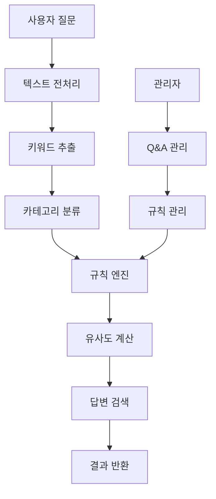
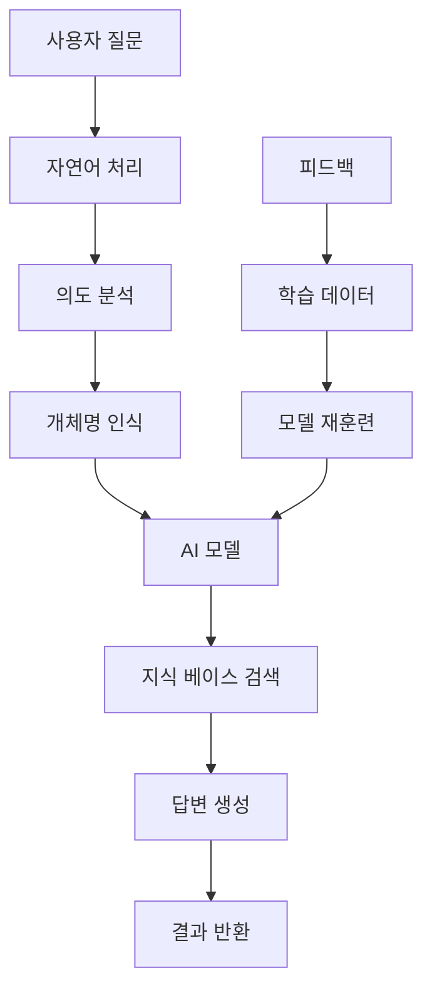

# Parmderi Q&A 검색 시스템 프로젝트 개요

## 🎯 프로젝트 목표

### 핵심 비전
**의료/의약품 전문 자연어 처리 기반 Q&A 검색 시스템** 개발
- 의료기관, 의약품, 제품 정보를 기반으로 한 전문 질의응답 플랫폼
- 사용자의 자연어 질문을 이해하고 의료 분야 최적의 답변을 제공
- 의료 데이터와 연동된 지능형 검색 및 추천 시스템
- 향후 AI 기반으로 확장 가능한 확장성 있는 아키텍처

### 도메인 특화 기능
- **의약품 검색**: EDI 코드, 활성성분, 제조업체 기반 검색
- **의료기관 조회**: 지역별, 전문과별 의료기관 정보 제공
- **제품 정보**: 의료 제품 및 수가 정보 연동
- **코드 관리**: 의료 표준 코드 체계 활용

## 📈 개발 로드맵

### Phase 1: 규칙 기반 시스템 (Rule-based) 
**목표**: 기본적인 Q&A 검색 기능 구현

#### 핵심 기능
- **의료 키워드 매칭**: 의약품명, 성분명, 의료기관명 등 전문 키워드 추출
- **도메인 분류**: 의약품/의료기관/제품별 카테고리 자동 분류
- **의료 데이터 연동**: 기존 의료 DB와 연계한 실시간 정보 제공
- **통합 검색**: 여러 의료 데이터 소스를 통합한 검색 결과
- **관리자 패널**: Q&A 및 의료 데이터 통합 관리

#### 기술 구현 방식
```
사용자 질문 → 의료 키워드 추출 → 도메인 분류 → 의료 DB 연동 → 통합 답변 반환
            ↓
        EDI코드/성분명 매칭 → 의약품/의료기관 정보 연계
```

#### 구현 예정 알고리즘
- **텍스트 전처리**: 불용어 제거, 형태소 분석
- **키워드 추출**: TF-IDF, N-gram 기반
- **유사도 측정**: 코사인 유사도, 자카드 유사도
- **규칙 엔진**: 조건문 기반 분기 처리

### Phase 2: 하이브리드 시스템
**목표**: 규칙 기반 + 머신러닝 결합

#### 확장 기능
- **의도 분석**: 질문의 의도 자동 파악
- **개체명 인식**: 인명, 지명, 기관명 등 자동 추출
- **학습 기반 개선**: 사용자 피드백 학습
- **다중 답변 순위**: 여러 답변을 신뢰도 순으로 제공

### Phase 3: AI 기반 시스템
**목표**: 완전한 자연어 이해 및 생성

#### AI 기능
- **딥러닝 모델**: Transformer 기반 언어 모델
- **문맥 이해**: 대화 흐름 및 문맥 파악
- **동적 답변 생성**: 기존 지식 기반 새로운 답변 생성
- **다국어 지원**: 여러 언어 질의응답

## 🏗️ 시스템 아키텍처

### Phase 1: 규칙 기반 아키텍처


### Phase 3: AI 기반 아키텍처 (목표)


## 💾 데이터베이스 설계

### 핵심 테이블 구조

#### 1. 질문-답변 테이블 (qa_pairs)
```sql
CREATE TABLE qa_pairs (
    id INT PRIMARY KEY AUTO_INCREMENT COMMENT '질문-답변 고유 ID',
    question TEXT NOT NULL COMMENT '질문 내용 (원문)',
    answer TEXT NOT NULL COMMENT '답변 내용 (HTML 태그 포함 가능)',
    category_id INT COMMENT '카테고리 ID (categories 테이블 참조)',
    keywords VARCHAR(500) COMMENT '검색용 키워드 (쉼표로 구분)',
    created_at TIMESTAMP DEFAULT CURRENT_TIMESTAMP COMMENT '생성 일시',
    updated_at TIMESTAMP DEFAULT CURRENT_TIMESTAMP ON UPDATE CURRENT_TIMESTAMP COMMENT '수정 일시',
    view_count INT DEFAULT 0 COMMENT '조회수 (검색 결과 클릭 횟수)',
    rating DECIMAL(3,2) DEFAULT 0.00 COMMENT '사용자 평가 점수 (0.00-5.00)',
    INDEX idx_category (category_id),
    INDEX idx_created (created_at),
    FULLTEXT KEY ft_question (question),
    FULLTEXT KEY ft_keywords (keywords)
) ENGINE=InnoDB DEFAULT CHARSET=utf8mb4 COLLATE=utf8mb4_unicode_ci COMMENT='Q&A 질문-답변 데이터 저장 테이블';
```

#### 2. 카테고리 테이블 (categories)
```sql
CREATE TABLE categories (
    id INT PRIMARY KEY AUTO_INCREMENT COMMENT '카테고리 고유 ID',
    name VARCHAR(100) NOT NULL COMMENT '카테고리 이름',
    description TEXT COMMENT '카테고리 상세 설명',
    parent_id INT NULL COMMENT '상위 카테고리 ID (계층 구조)',
    sort_order INT DEFAULT 0 COMMENT '정렬 순서 (낮은 수가 먼저)',
    is_active TINYINT(1) DEFAULT 1 COMMENT '활성 상태 (1:활성, 0:비활성)',
    created_at TIMESTAMP DEFAULT CURRENT_TIMESTAMP COMMENT '생성 일시',
    updated_at TIMESTAMP DEFAULT CURRENT_TIMESTAMP ON UPDATE CURRENT_TIMESTAMP COMMENT '수정 일시',
    INDEX idx_parent (parent_id),
    INDEX idx_sort (sort_order),
    INDEX idx_active (is_active),
    FOREIGN KEY (parent_id) REFERENCES categories(id) ON DELETE CASCADE
) ENGINE=InnoDB DEFAULT CHARSET=utf8mb4 COLLATE=utf8mb4_unicode_ci COMMENT='Q&A 카테고리 분류 테이블';
```

#### 3. 검색 로그 테이블 (search_logs)
```sql
CREATE TABLE search_logs (
    id INT PRIMARY KEY AUTO_INCREMENT COMMENT '검색 로그 고유 ID',
    user_query TEXT NOT NULL COMMENT '사용자가 입력한 검색 질문',
    matched_qa_id INT COMMENT '매칭된 Q&A ID (qa_pairs 테이블 참조)',
    similarity_score DECIMAL(5,4) COMMENT '유사도 점수 (0.0000-1.0000)',
    search_time TIMESTAMP DEFAULT CURRENT_TIMESTAMP COMMENT '검색 실행 시간',
    user_feedback ENUM('helpful', 'not_helpful', 'partially_helpful') COMMENT '사용자 피드백',
    response_time_ms INT COMMENT '응답 시간 (밀리초)',
    user_ip VARCHAR(45) COMMENT '사용자 IP 주소 (IPv4/IPv6)',
    user_agent TEXT COMMENT '사용자 브라우저 정보',
    session_id VARCHAR(128) COMMENT '세션 ID (동일 사용자 추적)',
    INDEX idx_search_time (search_time),
    INDEX idx_qa_id (matched_qa_id),
    INDEX idx_similarity (similarity_score),
    INDEX idx_feedback (user_feedback),
    INDEX idx_session (session_id),
    FULLTEXT KEY ft_user_query (user_query),
    FOREIGN KEY (matched_qa_id) REFERENCES qa_pairs(id) ON DELETE SET NULL
) ENGINE=InnoDB DEFAULT CHARSET=utf8mb4 COLLATE=utf8mb4_unicode_ci COMMENT='사용자 검색 이력 및 분석 데이터 저장';
```

#### 4. 키워드 테이블 (keywords)
```sql
CREATE TABLE keywords (
    id INT PRIMARY KEY AUTO_INCREMENT COMMENT '키워드 고유 ID',
    keyword VARCHAR(100) NOT NULL COMMENT '핵심 키워드',
    weight DECIMAL(3,2) DEFAULT 1.00 COMMENT '키워드 가중치 (0.01-9.99)',
    category_id INT COMMENT '연관 카테고리 ID',
    synonyms TEXT COMMENT '동의어 목록 (쉼표로 구분)',
    frequency INT DEFAULT 0 COMMENT '검색 빈도수',
    is_stopword TINYINT(1) DEFAULT 0 COMMENT '불용어 여부 (1:불용어, 0:일반어)',
    created_at TIMESTAMP DEFAULT CURRENT_TIMESTAMP COMMENT '생성 일시',
    updated_at TIMESTAMP DEFAULT CURRENT_TIMESTAMP ON UPDATE CURRENT_TIMESTAMP COMMENT '수정 일시',
    UNIQUE KEY uk_keyword (keyword),
    INDEX idx_category (category_id),
    INDEX idx_weight (weight),
    INDEX idx_frequency (frequency),
    INDEX idx_stopword (is_stopword),
    FULLTEXT KEY ft_synonyms (synonyms),
    FOREIGN KEY (category_id) REFERENCES categories(id) ON DELETE SET NULL
) ENGINE=InnoDB DEFAULT CHARSET=utf8mb4 COLLATE=utf8mb4_unicode_ci COMMENT='검색 최적화를 위한 키워드 사전';
```

#### 5. 사용자 피드백 테이블 (user_feedback)
```sql
CREATE TABLE user_feedback (
    id INT PRIMARY KEY AUTO_INCREMENT COMMENT '피드백 고유 ID',
    search_log_id INT NOT NULL COMMENT '검색 로그 ID (search_logs 테이블 참조)',
    qa_id INT NOT NULL COMMENT 'Q&A ID (qa_pairs 테이블 참조)', 
    rating TINYINT(1) NOT NULL COMMENT '평가 점수 (1-5점)',
    feedback_type ENUM('rating', 'report', 'suggestion') DEFAULT 'rating' COMMENT '피드백 유형',
    comment TEXT COMMENT '사용자 의견 및 제안사항',
    user_ip VARCHAR(45) COMMENT '사용자 IP 주소',
    created_at TIMESTAMP DEFAULT CURRENT_TIMESTAMP COMMENT '피드백 생성 시간',
    INDEX idx_search_log (search_log_id),
    INDEX idx_qa (qa_id),
    INDEX idx_rating (rating),
    INDEX idx_type (feedback_type),
    INDEX idx_created (created_at),
    FOREIGN KEY (search_log_id) REFERENCES search_logs(id) ON DELETE CASCADE,
    FOREIGN KEY (qa_id) REFERENCES qa_pairs(id) ON DELETE CASCADE
) ENGINE=InnoDB DEFAULT CHARSET=utf8mb4 COLLATE=utf8mb4_unicode_ci COMMENT='사용자 피드백 및 평가 데이터';
```

#### 6. 관리자 사용자 테이블 (admin_users)
```sql
CREATE TABLE admin_users (
    id INT PRIMARY KEY AUTO_INCREMENT COMMENT '관리자 ID',
    username VARCHAR(50) NOT NULL COMMENT '로그인 아이디',
    password_hash VARCHAR(255) NOT NULL COMMENT '암호화된 비밀번호',
    email VARCHAR(100) NOT NULL COMMENT '이메일 주소',
    full_name VARCHAR(100) COMMENT '전체 이름',
    role ENUM('super_admin', 'admin', 'editor') DEFAULT 'editor' COMMENT '권한 레벨',
    is_active TINYINT(1) DEFAULT 1 COMMENT '계정 활성 상태',
    last_login TIMESTAMP NULL COMMENT '마지막 로그인 시간',
    created_at TIMESTAMP DEFAULT CURRENT_TIMESTAMP COMMENT '계정 생성 시간',
    updated_at TIMESTAMP DEFAULT CURRENT_TIMESTAMP ON UPDATE CURRENT_TIMESTAMP COMMENT '정보 수정 시간',
    UNIQUE KEY uk_username (username),
    UNIQUE KEY uk_email (email),
    INDEX idx_role (role),
    INDEX idx_active (is_active),
    INDEX idx_last_login (last_login)
) ENGINE=InnoDB DEFAULT CHARSET=utf8mb4 COLLATE=utf8mb4_unicode_ci COMMENT='Q&A 시스템 관리자 계정';
```

## 💊 의료 전문 데이터 테이블

### 의약품 관련 테이블

#### 1. 의약품 기본 정보 (drug)
- **용도**: 의약품 상세 정보 저장
- **핵심 필드**: edi_code, name, manufacturer_name, active_ingredient_code
- **특징**: 보험 가격, ATC 코드, 생물학적 동등성 정보 포함

#### 2. 활성 성분 (active_ingredient, active_ingredient_code)
- **용도**: 의약품의 주성분 정보 관리
- **활용**: 성분 기반 유사 의약품 검색

#### 3. 제조업체 (manufacturer)
- **용도**: 의약품 제조사 정보
- **연동**: 의약품 테이블과 연계

### 의료기관 관련 테이블

#### 1. 의료기관 기본 정보 (medical_institution)
- **용도**: 병원, 의원, 약국 등 의료기관 정보
- **핵심 필드**: institution_code, name, address, specialty
- **특징**: 지리 좌표(GPS), 운영 상태 정보 포함

#### 2. 의료기관 전문 정보
- `medical_institution_facility` - 시설 정보
- `medical_institution_hospital` - 병원 상세 정보
- `medical_institution_specialty` - 진료과 정보

### 제품/서비스 테이블

#### 1. 제품 정보 (product)
- **용도**: 의료 제품 및 서비스 정보
- **특징**: 공급업체, 수가 정보, 생물학적 동등성 포함

#### 2. 제품 관련 정보
- `product_commission` - 수수료 정보
- `product_notice` - 제품 공지사항
- `product_rate_sheet` - 요율표

### 코드 관리 테이블

#### 1. 표준 코드 체계
- `address_code` - 주소 표준 코드
- `administrative_code` - 행정구역 코드
- `group_code` - 분류 그룹 코드
- `public_code` - 공통 코드

## 🛠️ 기술 스택 계획

### Phase 1: 규칙 기반 (의료 특화)
- **백엔드**: PHP 8.1 + CodeIgniter 3.x
- **데이터베이스**: MariaDB (의료 데이터 21개 테이블)
- **검색 엔진**: MySQL Full-Text Search + 의료 코드 매칭
- **의료 데이터**: EDI 코드, ATC 코드, 활성성분 코드 연동
- **텍스트 처리**: PHP + 의료 전문용어 사전
- **프론트엔드**: HTML5 + CSS3 + JavaScript (jQuery)

### Phase 2: 하이브리드
- **머신러닝**: Python + scikit-learn
- **자연어 처리**: KoNLPy (한국어 처리)
- **API 연동**: REST API 또는 gRPC
- **캐싱**: Redis
- **큐 시스템**: RabbitMQ

### Phase 3: AI 기반
- **AI 프레임워크**: TensorFlow 또는 PyTorch
- **언어 모델**: BERT, GPT 계열 또는 KoBERT
- **벡터 데이터베이스**: Elasticsearch 또는 Pinecone
- **컨테이너**: Kubernetes
- **모니터링**: Prometheus + Grafana

## 📊 성능 목표

### Phase 1 목표
- **응답 시간**: 평균 500ms 이하
- **정확도**: 70% 이상
- **동시 사용자**: 100명
- **데이터**: 1,000개 Q&A

### Phase 3 목표
- **응답 시간**: 평균 200ms 이하
- **정확도**: 90% 이상
- **동시 사용자**: 10,000명
- **데이터**: 100,000개 Q&A

## 🔄 개발 프로세스

### 1. 의료 특화 규칙 기반 개발 순서
1. **의료 데이터베이스 연동** 및 Q&A 테이블 생성 ✅
2. **의료 Q&A 관리 시스템** 개발 (의약품/의료기관 연계)
3. **의료 전문 키워드 추출** 엔진 개발 (EDI코드, 성분명 등)
4. **의료 데이터 통합 검색** 알고리즘 구현
5. **의료 정보 연동 API** 개발
6. **의료 전문 사용자 인터페이스** 구현
7. **의료 데이터 성능 최적화** 및 테스트

### 2. 의료 데이터 활용 및 구축
- **기존 의료 데이터**: 의약품 21개 테이블 활용 ✅
- **의료 FAQ 수집**: 의약품/의료기관/제품별 질문 수집
- **의료 카테고리**: 의약품, 의료기관, 제품, 수가 분류
- **의료 전문 키워드**: EDI코드, ATC코드, 성분명 기반 사전
- **의료 동의어**: 상품명/일반명, 의료기관 별칭 매핑

### 3. 품질 관리
- **정확도 측정**: A/B 테스트 및 사용자 피드백
- **성능 모니터링**: 응답 시간 및 시스템 리소스
- **지속적 개선**: 사용 패턴 분석 및 규칙 개선

## 🎯 단계별 성공 지표

### Phase 1 성공 지표
- [ ] 기본 Q&A 검색 기능 구현
- [ ] 관리자 패널 구현
- [ ] 키워드 매칭 정확도 70% 달성
- [ ] 사용자 인터페이스 완성

### Phase 2 성공 지표
- [ ] 의도 분석 기능 추가
- [ ] 머신러닝 모델 통합
- [ ] 정확도 80% 달성
- [ ] 실시간 학습 기능 구현

### Phase 3 성공 지표
- [ ] AI 모델 완전 통합
- [ ] 자연어 생성 기능
- [ ] 정확도 90% 달성
- [ ] 다국어 지원

---
**이 프로젝트는 단계적 발전을 통해 최첨단 AI Q&A 시스템으로 성장할 것입니다.** 🚀 